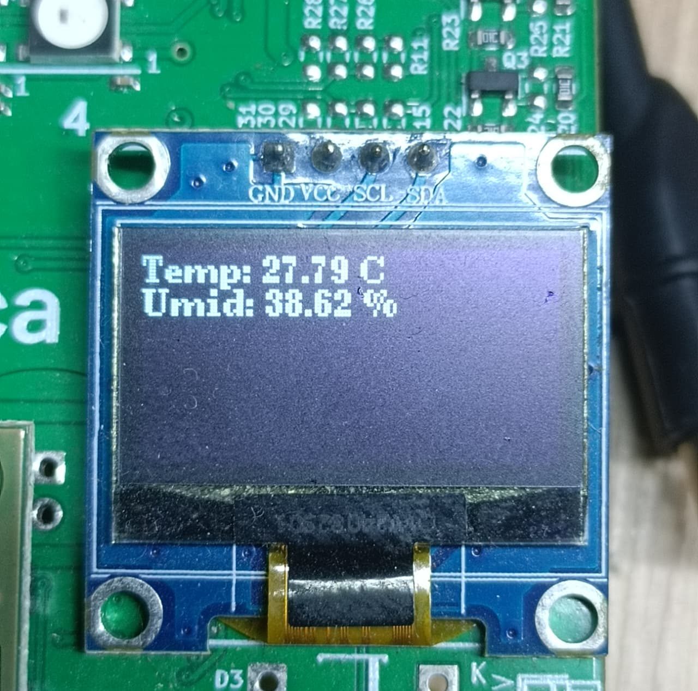
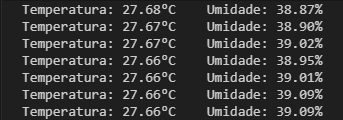

# Sistema de Monitoramento de Temperatura e Umidade com AHT10

## O que é o projeto

Este projeto implementa um sistema completo de monitoramento de temperatura e umidade utilizando o Raspberry Pi Pico W e o sensor digital AHT10. O sistema realiza leituras periódicas dos parâmetros ambientais, exibe os dados em um display OLED SSD1306 e transmite as informações via UART para monitoramento externo. O projeto foi desenvolvido em C++ seguindo os princípios SOLID e boas práticas de programação embarcada.

## Funcionalidades

- **Leitura de temperatura e umidade**: Captura precisa de dados ambientais através do sensor AHT10 via protocolo I2C
- **Display visual em tempo real**: Exibição dos valores de temperatura (°C) e umidade (%) em display OLED SSD1306 de 128x64 pixels
- **Sistema de alertas**: Notificações visuais para condições de alta umidade (>70%) e baixa temperatura (<20°C)
- **Comunicação serial**: Transmissão contínua dos dados via UART para monitoramento remoto ou logging
- **Arquitetura modular**: Código organizado em bibliotecas reutilizáveis para fácil manutenção e expansão

## Demonstração do sistema

O sistema em funcionamento apresenta os dados de temperatura e umidade tanto no display OLED quanto via comunicação serial:

### Display OLED em operação


### Saída via comunicação serial


## Estrutura de arquivos

```
Projeto AHT10/
├── CMakeLists.txt                  # Configuração principal do projeto
├── main.cpp                        # Arquivo principal da aplicação
├── pico_sdk_import.cmake          # Importação do Pico SDK
├── Aht10/                         # Biblioteca do sensor AHT10
│   └── src/
│       ├── Aht10.cpp              # Implementação da classe Aht10
│       ├── Aht10.h                # Interface da classe Aht10
├── PortaSerial/                   # Biblioteca de comunicação UART
│   └── src/
│       ├── PortaSerial.cpp        # Implementação da classe PortaSerial
│       ├── PortaSerial.h          # Interface da classe PortaSerial
├── lib/
│   └── u8g2pico/                  # Biblioteca wrapper para display U8G2
│       ├── u8g2pico.c
│       ├── u8g2pico.h
```

## Conexão com os periféricos

### Sensor AHT10 (I2C0)
- **SDA**: GPIO 0 (GP0)
- **SCL**: GPIO 1 (GP1)
- **VCC**: 3V3
- **GND**: GND

### Display OLED SSD1306 128x64 (I2C1)
- **SDA**: GPIO 14 (GP14)
- **SCL**: GPIO 15 (GP15)
- **VCC**: 3V3
- **GND**: GND
- **Endereço I2C**: 0x3C

### Comunicação Serial (UART1)
- **TX**: GPIO 8 (GP8)
- **RX**: GPIO 9 (GP9)
- **Baud Rate**: 115200
- **Configuração**: 8 bits de dados, sem paridade, 1 bit de parada

### Especificações técnicas
- **Microcontrolador**: Raspberry Pi Pico W (RP2040)
- **SDK**: Pico SDK 2.2.0
- **Linguagem**: C++ (padrão C++17)
- **Sistema de build**: CMake com Ninja
- **Frequência de amostragem**: 1 Hz (leitura a cada 1000ms)

---

**Desenvolvido por: Georgines Bezerra Pereira © 2025**